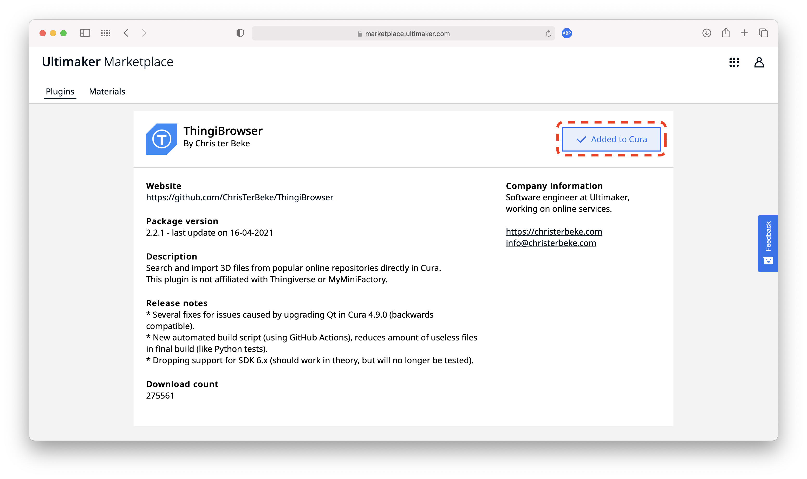

# Installation guide

There are two official installation methods for Cura plugins:

* [Via Ultimaker Cura](#Via-Ultimaker-Cura)
* [Via the Ultimaker Marketplace](#Via-the-Ultimaker-Marketplace)

## Via Ultimaker Cura

Open Ultimaker Cura and click on the Marketplace button.

In the Marketplace dialog, scroll down in the section with "Community Plugins" until you find the "ThingiBrowser" plugin.

Click on the tile to open the details page. Now click the "Install" button.

The "Install" button will now show a spinner while the plugin is downloading.
When downloading has completed, a licence agreement dialog will be shown.
Click "Agree" to finish the installation.

Now Cura will need to be restarted in order to activate the plugin.
Click "Quit Ultimaker Cura" in the Marketplace dialog and then start Cura again yourself.

After restarting, you can confirm that the plugin is installed in the "Installed" tab of the Marketplace.
On this page, you can also uninstall the plugin again by clicking "Uninstall".

You have now succesfully installed the ThingiBrowser plugin in Ultimaker Cura.

[Learn how to use the plugin](./usage.md)

## Via the Ultimaker Marketplace

Navigate to the [plugin page](https://marketplace.ultimaker.com/app/cura/plugins/ChrisTerBekeAuthor/ThingiBrowser) on the Ultimaker Marketplace.

Click "Add to Cura".

You will now be asked to sign in with an Ultimaker Account.
If you do not have an Ultimaker Account yet, you can create one for free on [account.ultimaker.com](https://account.ultimaker.com).

The plugin is now added to your Ultimaker Account.

Now start or open Ultimaker Cura and sign in with your Ultimaker Account.

After signing in, Cura will scan for new plugins added to the account and will automatically show a message to synchronize them.
If this message does not appear, you can manually check for updates in the account menu in the top right.

A new dialog appears that lists all the pending plugins.
Click "Next" to install them all.

A license dialog appears for every pending plugin that is being installed.
Click "Agree" to finish the installation.

After agreeing to the license, you have to restart Cura to activate the plugin.
This process is the same as for the first installation option.

You have now succesfully installed the ThingiBrowser plugin in Ultimaker Cura.

[Learn how to use the plugin](./usage.md)