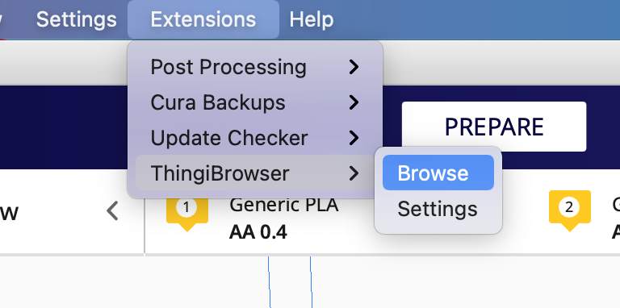

# User guide

Start the plugin via the "Extensions" menu in Cura.

## Main window

The main plugin window looks like this and has the following features:

* **1**: Select which website to connect to (Thingiverse or MyMiniFactory).
* **2**: Select which category to show (like "Popular" or "Newest").
* **3**: Search using one or more keywords. You can use <kbd>enter</kbd> or use the "Search" button.
* **4**: Open the settings window.
* **5**: A direct link to the original website.
* **6**: Open the details page for this item.
* **7**: Navigate through the paginated results.

## Details window

The item details window looks like this and has the following features:

* **1**: Back to the main plugin window.
* **2**: A direct link to the original website.
* **3**: Add the 3D file to the build plate. You can add the same file multiple times as well.

## Settings window

The settings window looks like this and has the following features:

* **1**: Configure your MyMiniFactory account to access categories like your "Liked" items.
* **2**: Configure your Thingiverse account to access categories like your "Liked" items.
* **3**: Which website should be selected when the plugin is opened.
* **4**: Which category should be selected when the plugin is opened.
